# Legends Obsidian

**One name for your Obsidian knowledge system. Grok, Codex, Gemini, or Claude.**

Legends Obsidian is a provider-neutral distribution of **[Daniel Agrici's
claude-obsidian](https://github.com/AgriciDaniel/claude-obsidian)**. Daniel built
the knowledge engine, canonical workflows, transaction safety, and templates.
This release keeps that foundation intact and adds consistent Legends naming
and host installation. **Please visit and star [Daniel's original project](https://github.com/AgriciDaniel/claude-obsidian).**

<a href="LICENSE"></a>
<a href="CHANGELOG.md"></a>

Capture sources, create connected notes, retrieve grounded answers, and keep
your vault healthy. Your knowledge remains ordinary Markdown on your disk.
Say **“Legends Obsidian”** to your agent; the routing skill chooses the relevant
workflow. All 15 upstream skills remain, with one additional neutral router.

## Install for your agent

Clone this product to a permanent location separate from your vault:

```bash
git clone https://github.com/avalonreset/legends-obsidian.git
cd legends-obsidian
```

On Linux, macOS, or WSL, preview then install for the host you use:

```bash
bash bin/setup-multi-agent.sh --host grok
bash bin/setup-multi-agent.sh --host grok --apply
```

Replace `grok` with `codex`, `gemini`, or `claude`. You can repeat `--host`.
On native Windows, use PowerShell and Python 3.11+:

```powershell
pwsh -File bin/setup-multi-agent.ps1 -Hosts codex
pwsh -File bin/setup-multi-agent.ps1 -Hosts codex -Mode apply
```

Existing skills and links are preserved. Restart your agent after installation,
then ask: **“Use Legends Obsidian to inspect my vault at [your vault path].”**
Claude Code also supports the [plugin installation](docs/install-guide.md).

**Platform support:** Linux/macOS/WSL support the complete protected transaction
workflow. Native Windows supports installation, inspection, previews, and
queries against existing indexes; protected writes and index creation require
WSL. Agent compatibility does not remove that upstream filesystem requirement.
See the [host evidence matrix](docs/AGENTS-MATRIX.md) and
[Windows guide](docs/windows-wsl.md).

## Built on Daniel's work

This distribution includes upstream **v2.1.1 plus public main `ad67087`**, which
adds recovery, checkpoint, and response hardening. The engine, 15 canonical
skill trees, runtime scripts, hooks, and templates are verified against pinned
upstream hashes. One documented fix makes ZIP auditing binary-safe on Windows;
77 of 78 protected files are unchanged. The original MIT copyright is preserved.

[Exact provenance and changes](docs/UPSTREAM.md) · [Attribution](ATTRIBUTION.md)
· [Installation](docs/install-guide.md) · [Security](SECURITY.md)

Internal package names and vault schemas retain their upstream identifiers for
compatibility. The user-facing name is **Legends Obsidian**.

## From source to living knowledge

Most AI note workflows stop after saving text. Legends Obsidian is organized
around a repeatable loop: retain the source, ground the claims, connect the
knowledge, then put it back to work.



- **Capture with context.** Bring local sources through a visible inbox and
  preserve immutable, content-addressed copies before synthesis.
- **Ground every important claim.** Source and claim ledgers retain authority,
  freshness, support, contradiction, confidence, and review state.
- **Connect what you learn.** Build linked pages, indexes, Maps of Content,
  methodology-aware structures, and Obsidian Canvas views.
- **Use the vault again.** Query, research, retrieve, lint, and fold what is
  already known instead of starting every conversation from zero.

## See the vault

The output is meant to remain useful with or without an agent: plain Markdown
for portability, Obsidian for navigation and visual exploration.

<p align="center">
  
  
</p>

<p align="center">
  <sub>Linked knowledge in Graph view · A visual knowledge map in Obsidian Canvas</sub>
</p>

## Why it feels different

- **Local by default.** The vault is user-owned and works as ordinary files.
  Network egress is a separate, explicit decision.
- **Sources survive the summary.** Notes point back to durable source evidence;
  unsupported and contradictory claims remain visible.
- **Knowledge compounds deliberately.** Ingestion, querying, linting, retrieval,
  research, and rollups share one provenance-aware model.
- **Parallel agents cannot race the vault.** Workers return drafts. One
  orchestrator inspects and applies one recoverable transaction.
- **Capabilities are stated honestly.** Optional tools are detected, maturity
  is declared, and missing adapters degrade clearly instead of being simulated.

This is not an automatic transcript recorder, a cloud sync service, a factual
oracle, or a substitute for backups and source control.

## Quick start

The safest first run uses a source checkout and a separate user vault. Every
mutating setup command previews its exact operation before it can apply.

### 1. Get the product

```bash
git clone https://github.com/avalonreset/legends-obsidian.git
cd legends-obsidian
```

The checkout contains the product. It is not your knowledge vault.

### 2. Initialize a separate vault

```bash
export GENERATED_AT="$(date -u +%Y-%m-%dT%H:%M:%SZ)"
export OPERATION_ID="init-reviewed"

python3 scripts/claude-obsidian.py init "$HOME/Documents/MyKnowledgeVault" \
  --generated-at "$GENERATED_AT" --operation-id "$OPERATION_ID"
```

Review the JSON plan and copy its `approved_plan_sha256`, then apply that exact
operation:

```bash
python3 scripts/claude-obsidian.py init "$HOME/Documents/MyKnowledgeVault" \
  --generated-at "$GENERATED_AT" --operation-id "$OPERATION_ID" \
  --approved-plan-sha256 "<sha256-from-the-plan>" --apply
```

For an existing Obsidian vault, use the non-destructive `adopt` workflow
described in the [installation guide](docs/install-guide.md#adopt-an-existing-vault).

### 3. Start from the vault

Open the new directory in Obsidian, then run Claude Code from that directory
with the local plugin:

```bash
cd "$HOME/Documents/MyKnowledgeVault"
claude --plugin-dir /absolute/path/to/legends-obsidian
```

Start with:

```text
/legends-obsidian:wiki
```

Then place a source in `inbox/` and invoke
`/legends-obsidian:wiki-ingest`. Save an answer explicitly with
`/legends-obsidian:save`; ask the vault with `/legends-obsidian:wiki-query`.

For Grok, Codex, Gemini, Claude, or OpenCode, preview and then apply the portable skill links
from the product checkout:

```bash
bash bin/setup-multi-agent.sh --host codex
bash bin/setup-multi-agent.sh --host codex --apply
```

Cursor and Windsurf use workspace-local skill discovery. Marketplace setup,
every supported host, vault adoption, upgrades, and uninstall steps are covered
in the [full installation guide](docs/install-guide.md).

## 15 skills, one system

The skills are small enough to invoke directly and coordinated enough to share
the same evidence, vault-selection, and mutation rules.

### Build and use the wiki

| Skill | What it does |
|---|---|
| `wiki` | Initializes or adopts a vault, diagnoses readiness, and routes work |
| `save` | Saves one scoped answer or insight—never an automatic transcript |
| `wiki-ingest` | Turns captured sources into linked pages and provenance records |
| `wiki-query` | Answers read-only from relevant vault evidence |
| `wiki-lint` | Reports dead links, orphans, metadata gaps, stale indexes, and empty sections |

### Extend the workflow

| Skill | What it adds |
|---|---|
| `autoresearch` | Bounded web research with explicit egress and a separate canonical merge |
| `canvas` | Wiki-scoped Obsidian Canvas creation and maintenance |
| `defuddle` | Clean, readable web content before ingestion |
| `wiki-fold` | Extractive, traceable rollups of the operation log |
| `wiki-mode` | Generic, LYT, PARA, or Zettelkasten filing conventions |
| `wiki-retrieve` | Contextual prefixes, BM25, and optional cosine reranking |
| `wiki-cli` | Obsidian CLI reads and search with transaction-safe writes |

### Reference skills

| Skill | What it provides |
|---|---|
| `obsidian-markdown` | Correct Obsidian Flavored Markdown, links, embeds, and callouts |
| `obsidian-bases` | Native `.base` tables, cards, filters, formulas, and summaries |
| `think` | A structured observe, listen, connect, create, and grow review loop |

Claude Code exposes namespaced invocations such as
`/legends-obsidian:wiki-lint`; other hosts use their native Agent Skills
invocation. Trigger phrases and exact contracts live in each
`skills/<name>/SKILL.md`.

## Trust is part of the architecture



The product never treats a source checkout, plugin cache, or contributor state
as the default vault. A vault is selected explicitly, through
`CLAUDE_OBSIDIAN_VAULT`, by the nearest `.claude-obsidian.json`, or by one
unambiguous initialized ancestor. If selection is uncertain, the command exits
without writing.

One logical knowledge operation is one recoverable transaction:

1. Read every target and record its expected SHA-256.
2. Let parallel workers return drafts and evidence only.
3. Merge the complete change into one operation bundle.
4. Inspect the bundle, then apply it once.
5. Report the operation ID and exact changed paths.

The core holds one process-lifetime vault lock, journals backups, uses atomic
replacement, and restores the prior state if an apply cannot finish. A changed
target is a conflict, never a silent overwrite. Git checkpoints, destructive
repairs, network egress, and canonical research merges remain explicit
operations.

Read the [transaction contract](skills/wiki/references/operation-transactions.md),
[provenance contract](skills/wiki/references/provenance.md), and
[Compound Vault architecture](docs/compound-vault-guide.md) for the
machine-facing detail.

## Honest capability boundaries

| Input or capability | Current support |
|---|---|
| Local filesystem sources | Implemented bounded, content-addressed byte capture |
| Images | Metadata, hash, size, and bounded dimensions when available |
| PDF and EPUB | Metadata, hash, and size; no built-in semantic extraction |
| URL and YouTube | Validated consent plans; a configured external runner is required |
| OCR | Local-file consent plan; a configured external runner is required |
| BM25 retrieval | Local and deterministic |
| Contextual prefixes or remote models | Optional and gated by explicit egress consent |
| Obsidian CLI | Optional for reads/search; filesystem transport remains available |

High-risk accepted claims require two independent sources. Unsupported or
contradictory evidence stays visible, and a grounded refusal is preferred over
an invented citation. Model-based retrieval falls back to deterministic BM25
when the embedding or reranking stage cannot be trusted.

## Shape the vault to the way you think

`wiki-mode` can route new notes using four methodologies without bulk-moving
existing knowledge:

| Mode | Filing principle |
|---|---|
| Generic | Sources, concepts, entities, and sessions |
| LYT | Maps of Content and linked atomic notes |
| PARA | Projects, Areas, Resources, and Archives |
| Zettelkasten | Stable identifiers, atomic notes, and dense links |

Generic is the default when no mode is configured. Switching modes changes how
new notes are routed; it does not silently reorganize old ones. See the
[methodology modes guide](docs/methodology-modes-guide.md).

## Operator reference

<details>
<summary><strong>Portable CLI</strong></summary>

The wrapper is `python3 scripts/claude-obsidian.py`.

| Command | Effect |
|---|---|
| `doctor --vault PATH` | Show vault selection and readiness |
| `init PATH [--approved-plan-sha256 HASH --apply]` | Plan or create a separate vault |
| `adopt PATH [--approved-plan-sha256 HASH --apply]` | Plan or adopt an existing Obsidian vault |
| `migrate --vault PATH [--approved-plan-sha256 HASH --apply]` | Add v1 ledgers and configuration without rewriting legacy data |
| `transaction inspect BUNDLE --vault PATH` | Validate a write bundle without mutation |
| `transaction apply BUNDLE --vault PATH --approved-plan-sha256 HASH` | Apply one inspected, recoverable operation |
| `transaction recover --vault PATH [--force-stale-lock]` | Restore an interrupted operation |
| `lint --vault PATH [--as-of YYYY-MM-DD]` | Emit findings deterministic for the declared UTC date |
| `contracts --verify --vault PATH` | Execute capability readiness contracts |
| `capture plan --vault PATH [SOURCE ...]` | Run a local capture preflight without writes |
| `capture apply --vault PATH [SOURCE ...]` | Plan or create immutable content-addressed copies |
| `checkpoint OPERATION_ID --vault PATH` | Explicitly commit one completed operation |
| `package validate` | Check skills, hooks, manifests, and documentation coherence |
| `release build --output FILE.zip` | Build and self-audit a deterministic public artifact |
| `release audit FILE.zip` | Audit an artifact without extracting or publishing it |

High-level mutating planners emit `approved_plan_sha256`. Pin
`--generated-at` and `--operation-id`, review the JSON operation, and pass that
exact hash with `--apply`. Filesystem or generated-bundle drift fails before a
vault write.

</details>

<details>
<summary><strong>Repository and vault layout</strong></summary>

```text
product repository/                user vault/
├── claude_obsidian/               ├── .gitignore
├── skills/                        ├── .claude-obsidian.json
├── hooks/                         ├── inbox/
├── scripts/                       ├── .raw/
├── templates/vault/               ├── wiki/
├── config/                        ├── .obsidian/
├── assets/                        └── .vault-meta/   # ignored runtime state
└── tests/
```

Public artifacts contain product code, deterministic templates, and reviewed
README assets. They reject contributor hot/log state, root raw sources, runtime
metadata, private paths, recognizable personal email addresses, secrets,
symlinks, unsafe archive entries, and unreviewed binaries.

The private development checkout deliberately has no marketplace catalog. The
release builder injects the reviewed catalog only into the distribution-clean
artifact. A public default branch must be populated from that audited tree,
never by pushing contributor-vault state.

</details>

<details>
<summary><strong>Upgrade, rollback, and uninstall</strong></summary>

Upgrade the product independently from the vault. For an older vault, first
preview the additive, idempotent migration:

```bash
python3 scripts/claude-obsidian.py migrate --vault /path/to/vault \
  --generated-at "$GENERATED_AT" --operation-id migrate-reviewed
```

Review its hash and rerun with `--approved-plan-sha256 HASH --apply`.
Migration preserves the legacy raw manifest byte-for-byte and does not infer
claims from prose.

After an interrupted operation, run:

```bash
python3 scripts/claude-obsidian.py transaction recover --vault /path/to/vault
```

Removing the plugin or host links never removes the vault. Delete only the
integration you installed; user notes, sources, ledgers, and Obsidian settings
remain yours.

</details>

## Requirements

- Python 3.11 or newer for the portable core
- Obsidian for the visual vault experience; plain Markdown remains usable
  without it
- Bash for setup, optional extensions, and shell test suites
- Git only for development, releases, or an explicit knowledge checkpoint

CI exercises Linux and macOS, plus a native-Windows smoke job for the portable
surface. On native Windows (including Git Bash), read-only inspection and
dry-run commands work; vault writes require WSL and fail closed with an
`UNSUPPORTED_PLATFORM` error otherwise. Approval hashes bind to the reviewing
environment, so review inside WSL when the apply will happen there. Platform
details, the support matrix, and evidence-bounded WSL hang troubleshooting
live in the
[Windows and WSL guide](docs/windows-wsl.md). The bash setup scripts and shell
test suites remain POSIX-only. Optional tools such as Obsidian CLI, Ollama,
and defuddle are capability-detected and affect only their dependent workflow.

## Development and release

```bash
make test
```

The test target runs every hermetic Python and shell suite, product and
capability contracts, skill and hook validation, manifest checks, and package
boundaries. CI repeats the suite on supported Linux and macOS/Python
combinations and verifies a byte-reproducible release build.

Build and audit locally without publishing:

```bash
python3 scripts/claude-obsidian.py release build --output dist/legends-obsidian.zip
python3 scripts/claude-obsidian.py release audit dist/legends-obsidian.zip
```

No command pushes, tags, publishes, opens issues, or creates releases
automatically. See [CONTRIBUTING.md](CONTRIBUTING.md),
[SECURITY.md](SECURITY.md), and [CODE_OF_CONDUCT.md](CODE_OF_CONDUCT.md).

## Lineage, license, and attribution

The design follows
[Andrej Karpathy's LLM Wiki pattern](https://gist.github.com/karpathy/442a6bf555914893e9891c11519de94f)
and uses [kepano/obsidian-skills](https://github.com/kepano/obsidian-skills)
as the reference substrate for Obsidian Markdown, Bases, and JSON Canvas
syntax.

MIT licensed. See [ATTRIBUTION.md](ATTRIBUTION.md) and
[CITATION.cff](CITATION.cff).
