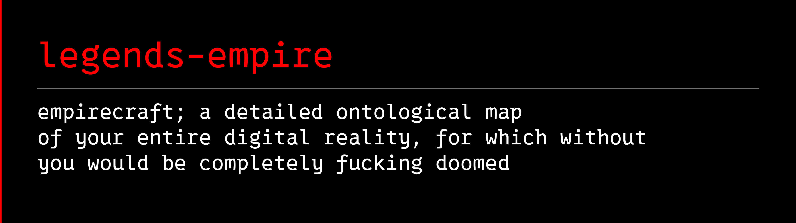

<p align="left">
  
</p>

**Your business, research, and projects. One workspace. Knowledge that compounds.**

[Get started](#start-building-your-empire) · [Releases](https://github.com/avalonreset/legends-empire/releases) · [Documentation](docs/install-guide.md) · [Attribution](#attribution)

## Everything connects here

Your business does not happen in one app. Neither does your life.

There are client folders, research reports, websites, projects, conversations, decisions, and unfinished ideas. Each contains something useful. The value grows when you can find the connection between them and carry that understanding into the next piece of work.

`legends-empire` is the knowledge foundation of the Legends ecosystem: an owned workspace where sources become connected knowledge, decisions retain their context, and agents can build on what you already know.

Call your home folder `Empire`. Give the work a place to live.

The files stay yours. Markdown remains readable. Obsidian gives you a visual interface. Agents help you collect, connect, retrieve, and maintain the knowledge.

---

## A home for the whole operation

| Bring together | Build understanding around |
|---|---|
| **Your businesses** | Offers, strategy, operations, systems, and the reasoning behind them. |
| **Your clients** | Research, relationships, deliverables, decisions, and the next useful action. |
| **Your projects** | What exists, what is intended, what changed, and what happens next. |
| **Your research** | Original sources, evidence, competing explanations, and reusable findings. |
| **Your wider world** | Skills, ideas, people, resources, and the ambitions that connect the work. |

This is the organizing philosophy, not a claim that installation already knows your business. Your structure grows from real material and deliberate choices.

### One home does not mean one enormous pile

The Empire direction is one navigable map of your work. External repositories, client folders, and other vaults can remain where they belong. The knowledge layer records their purpose and relationships rather than requiring you to move everything into a single folder.

Two views keep that map honest:

- **The Map:** what actually exists, supported by files and evidence.
- **The Blueprint:** what you want to build next.

The planned **hot wiki index** is the compact starting point for an agent: current priorities and links to the relevant knowledge. Detailed history belongs behind those links, so every task does not require loading the entire vault.

## Turn work into reusable intelligence

**Capture → connect → retrieve → decide → keep learning.**

The released memory tools provide the foundation:

- **Keep the evidence.** Capture sources and retain provenance rather than saving an unexplained summary.
- **Build connected notes.** Link subjects, sources, and findings into a navigable wiki.
- **Ask grounded questions.** Retrieve relevant material and inspect the evidence behind an answer.
- **Maintain the knowledge.** Review inconsistencies and apply recoverable note transactions.

For example: research collected for a local visibility study can inform a later client brief. The value is remembering where the evidence came from, which business it describes, and whether it still answers the new question. Reuse needs those checks; a familiar keyword alone is not enough.

## One ecosystem, independent tools

[cto-legends](https://github.com/avalonreset/cto-legends) is the entry point for discovering tools and loading their instructions. `legends-empire` provides the durable knowledge layer those workflows can use.

Search research, local visibility, GitHub improvement, and media production remain independent modules. They do their particular jobs; useful evidence and decisions can return to your chosen workspace through an explicit handoff.

**One central entry point. Focused tools. Knowledge that survives the conversation.**

## Start building your Empire

This repository is now named `legends-empire`. The current release retains the source-cited memory engine and its existing technical command names. Unified workspace creation, adoption, territory mapping, and hot-index onboarding are being integrated; they are not yet part of the published release.

1. Download the current package from [Releases](https://github.com/avalonreset/legends-empire/releases) and extract it separately from your personal vault.
2. Follow the [installation guide](docs/install-guide.md) and read `skills/legends-obsidian/SKILL.md`, the current portable entry recipe.
3. Select the vault you intend to work with. Start with one real source and use the documented capture and retrieval workflow.

To inspect the released command interface from the extracted package:

```sh
python scripts/claude-obsidian.py --help
```

The historical command and skill identifiers remain for compatibility. Native Windows supports inspection and previews; transactional writes currently require WSL or a supported POSIX host. See [Windows and WSL](docs/windows-wsl.md).

The product source and your personal Empire are separate. Installing the tools does not publish your vault or reorganize your existing files.

---

## Attribution

The Empire workspace concept and Legends ecosystem direction are Benjamin's. `legends-empire` incorporates source-cited wiki and memory tooling from [claude-obsidian](https://github.com/AgriciDaniel/claude-obsidian) by Daniel Agrici ([AgriciDaniel](https://github.com/AgriciDaniel)), under the MIT license.

Original copyright, license, and contributor notices are preserved in [LICENSE](LICENSE), [ATTRIBUTION.md](ATTRIBUTION.md), and [CITATION.cff](CITATION.cff).

---

[cto-legends](https://cto-legends.com) · [ai-marketing-hub-pro](https://www.skool.com/ai-marketing-hub-pro)